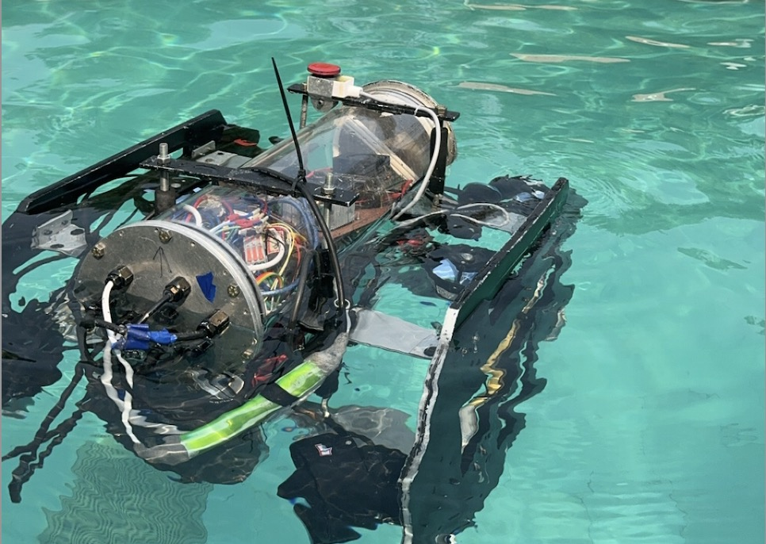
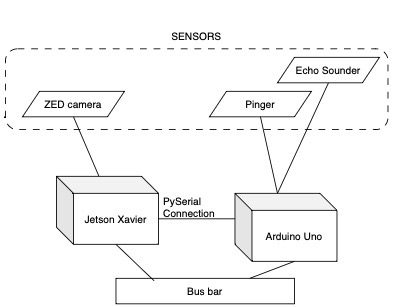

# Autonomous Underwater Vehicle - Mahindra University 

This repository contains the codes developed for the AUV for the Singapore Autonomous Underwater Challenge (SAUVC). It contains the training notebooks, object-detection code, and client-server communication code between the Arduino and the Jetson Xavier.
[[Technical Report]](./assets/MU_AUV_Technical_Report2024.pdf) [[Demo]](./assets/AUV.mp4)

---
## Contents:
1. Description
2. Installation requirements and steps
3. Files
4. Model accuracy
5. Contact

---
### 1.Description:
The SAUVC challenge comprises of two rounds and namely four tasks: Navigation, Target acquisition, Target reacquisition, and Communication and localization. 

### 2. Requirements and installation:
The hardware components used for the AUV are: Jetson Xavier (edge computer used for AI tasks such as path-planning, obstacle avoidance, and object-detection), and Arduino (microcontroller for communicating with the 6 T200 thrusters).



**Requirements**
```
Python 3.8
Libraries used: OpenCV, Numpy, torch, Ultralytics, sys, serial, pyzed

Torch and Torchvision versions:
>>> print(torch.__version__)
1.14.0a0+44dac51c.nv23.02
>>> print(torchvision.__version__)
0.14.1a0+5e8e2f1
```
```
conda create -n env_name python=3.8
conda activate env_name
```
**How to run:**
```
git clone https://github.com/MKD-026/AUV-MU.git
cd AUV-MU
```

### 3. Files:
- temp.sh: This code helps in monitoring the GPU and CPU temperatures of the AUV.
- functions.py: This file contains the controller commands to move the AUV: 
    - Surge (forward and backward movement)
    - Yaw (turn left and turn right)
    - Surge+Yaw (Move diagonal left and move disgonal right) 
- finaltrackingtensor.py: This is the main code that imports all the files, it loads the object detection model, determines the direction the AUV should proceed, and sends commands to the arduino to manipulate the thruster speeds. 
- zed_sensors.py: Testing sensors present in the ZED 2i camera. 
- pyFirmata.py: Testing using pyFirmata communiation library.
- yolov8_training.ipynb: Training notebook for training Yolo v8nano.

### 4. Model accuracy:
The models used for object detection are: Yolo v5nano, V7, V8nano. The criteria used to evaluate the aforementioned models are *Precision* and *Recall*. The models have been further optimized to run using CUDA. 

| Model name | Precision | Recall | Inference speed |
| --- | --- | --- | --- |
| Yolo V5 Nano | 88.5 | 28| 38FPS |
| Yolo V7 small | 89.2 | 32 | 34FPS |
| Yolo V8 Nano | 88.3 | 23 | 42FPS |

As Yolo V8nano has the highest inference speed, we chose to use this model for the AI tasks. 

### 5. Contact:
For more information about the project, please feel free to reach out at: das20ucse101@mahindrauniversity.edu.in

---
